# Basic Food Basket Flowchart

Repositório contendo o trabalho “Cesta Básica” desenvolvido por Fabio Toledo Bonemer de Salvi como parte da disciplina Algoritmos e Pensamento Computacional.

---

## 📄 Descrição do Projeto

Este projeto consiste em uma atividade que tem como objetivo representar, por meio de fluxograma e pseudocódigo, a análise da variação de preço dos produtos que compoem uma cesta básica. 

No arquivo disponibilizado [Atividade1_CestaBasica_FabioToledoBonemerDeSalvi.pdf](word/Atividade1_CestaBasica_FabioToledoBonemerDeSalvi.pdf) são apresentadas:

- A definição do problema: analisar a variação do preço dos produtos que compõem uma cesta básica dado o nome do produto, o preço no mês anterior e o preço no mes atual.
- O fluxograma que mostra o fluxo lógico do algoritmo, com entrada de dados, processamento dos valores e saída do resultado.  
- O pseudocódigo correspondente, estruturado para facilitar entendimento e implementação futura.

---

## 💪 Resultados

### Fluxogramas

- Função Principal

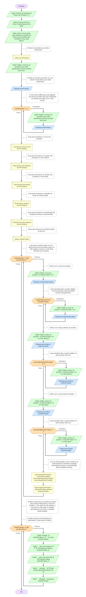

- Função estaEmBranco

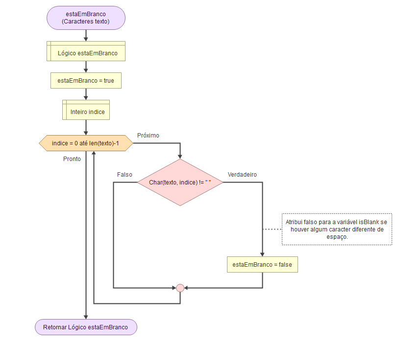

- Função variacaoPercentual

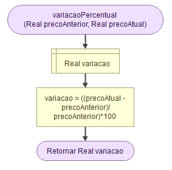

- Função situacaoProduto

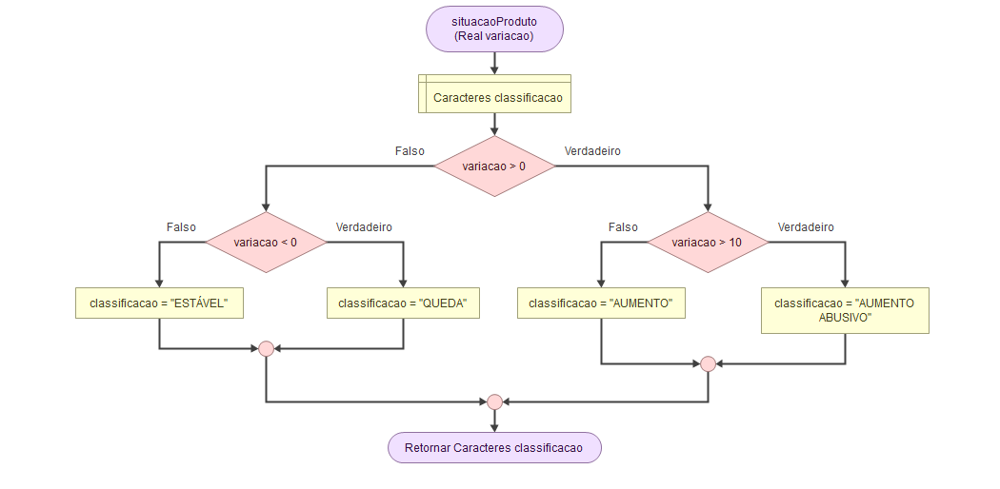

### Simulação

 
- Mensagem inicial

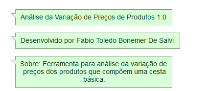

 
- Definindo o número de itens que serão analisados

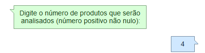
    
 
- Digitando os dados para o primeiro produto

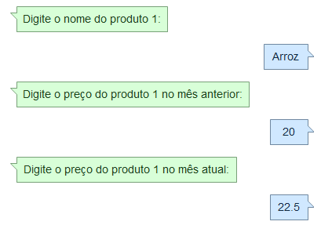

 
- Digitando os dados para o segundo produto

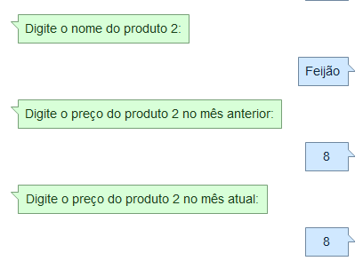

 
- Digitando os dados para o terceiro produto

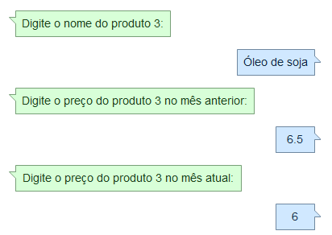

 
- Digitando os dados para o quarto produto

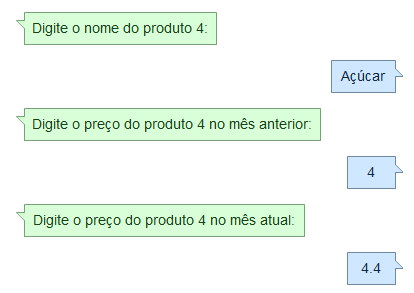

 
- Análise da variação de preço para o primeiro produto

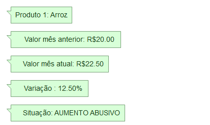

 
- Análise da variação de preço para o segundo produto

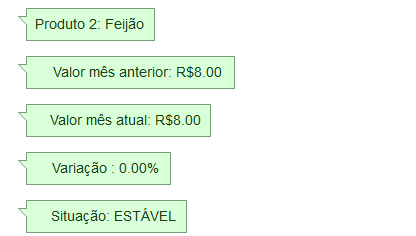

 
- Análise da variação de preço para o terceiro produto

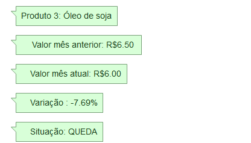

 
- Análise da variação de preço para o quarto produto

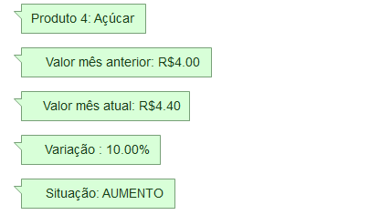

## 🛠 Como usar

1. Abra o arquivo PDF para ver os detalhes da atividade: fluxo, entradas, saídas, variáveis.  
2. Analise o fluxograma para compreender o passo a passo lógico.  
3. Veja o pseudocódigo para entender como seria traduzido para uma linguagem de programação.  
4. Pode-se adaptar ou estender para incluir mais itens, ajustar preços ou gerar relatórios mais completos.

